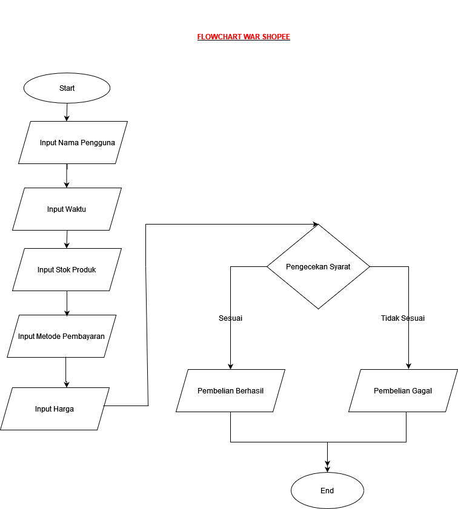

## PROGRAM WAR SHOPEE
War Shoope yaitu di mana pengguna berusaha untuk membeli produk dengan stok terbatas dalam waktu yang sangat singkat. Untuk memastikan proses ini berjalan dengan adil dan efisien, diperlukan sistem yang dapat menangani input pengguna, mengecek batas waktu, stok produk, dan memproses metode pembayaran secara otomatis. Studi kasus ini menggambarkan sebuah simulasi sederhana untuk menentukan apakah pengguna berhasil membeli produk dalam situasi "war" menggunakan Python.

# Program harus meminta input berupa:
Nama Pengguna
Waktu Pengguna
Stok Produk
Pembayaran
Harga

# Syarat dan Ketentuan:
Stok produk <= 10  
Batas waktu <= 5 detik
Minimal Pembelian > 500000
Metode Pembayaran selain COD 
Pembelian akan dikenakan admin Rp 1000

# Jika pengguna berhasil memenuhi semua syarat, output akan menampilkan pesan 'Selamat Pembelian Berhasil'
# Jika pengguna gagal memenuhi syarat, ouput akan menampilkan pesan 'Maaf, Pembelian Gagal'

# FLOWCHART
